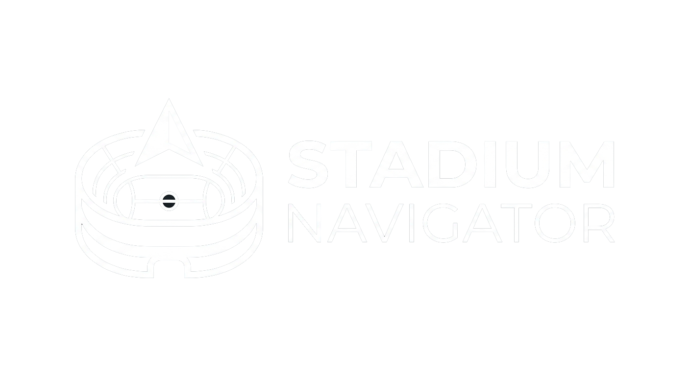

  
  <h1>Stadium Navigator</h1>
  
<strong>A personal gateway to the beautiful game, designed for everyone.</strong>

---

## The Story Behind the Navigator

I built this for my best friend, Leo. 

Leo and I grew up kicking a battered football against the brick wall behind our school until the sun went down. He knew every stat, every historic World Cup moment, and every chant by heart. His ultimate dream—our dream—was to one day hear the deafening roar of a stadium during a World Cup Final. 

But as we grew older, a degenerative condition meant Leo had to rely on a wheelchair. Slowly, his world physically shrank, even as his love for the game expanded. When the 2026 World Cup Final was announced for MetLife Stadium, I managed to get two tickets. I drove straight to his house, bursting with excitement. 

I expected tears of joy. Instead, I saw sheer terror in his eyes.

"I can't go," he whispered, staring at his chair. "It's a labyrinth. Thousands of people rushing, stairs out of nowhere, narrow turnstiles... What if we get separated? What if an emergency happens and I'm stuck? I'll just be in the way. I'd be completely alone in a sea of eighty thousand people."

That broke my heart. The stadium, a place that should represent unity and pure joy, felt like a towering fortress of anxiety to him. The sheer scale and unpredictability of the venue made him feel small and helpless. 

**Stadium Navigator** was born from that exact moment. 

I promised him he would never feel alone or lost in that crowd. I designed this app to be a silent, steadfast companion. It doesn't just show a map; it adapts to *who you are*. For Leo, it finds the step-free ramps. For our friend Sarah, who is visually impaired, it speaks the match updates aloud. For the deaf community, it flashes high-contrast, unmissable alerts. And most importantly, with a single tap of a floating red button, you are instantly connected to stadium staff—ensuring that you are never, ever truly alone.

We went to that match. When the final whistle blew and the stadium erupted, I looked over at Leo. He wasn't looking at his wheelchair. He wasn't looking around nervously. He was looking at the pitch, tears streaming down his face, completely lost in the magic of the game.

This project is for Leo. It's for anyone who has ever felt that the world isn't built for them. Because the beautiful game belongs to all of us.

---

## Features

- **Personalised Accessibility Profiles:** Routes and UI adaptations for Mobility (step-free), Vision (audio updates), and Hearing (high-contrast visual banners).
- **Live Match Tracking:** Real-time updates delivered in a format that suits your needs.
- **Dynamic Wayfinding:** Smart exit routing to avoid congestion.
- **Instant SOS Connection:** A persistent, floating emergency button that instantly alerts stadium staff to your exact location if you need assistance.
- **Multi-Language Support:** Seamlessly translates the entire experience into 7 different languages.

## Getting Started

1. Clone the repository.
2. Open the project in your preferred IDE.
3. Serve the `public` directory (or access the deployed Firebase URL).
4. Tap "Scan Ticket (Demo)" to begin the journey.

---
*Created with love, for the love of the game.*
